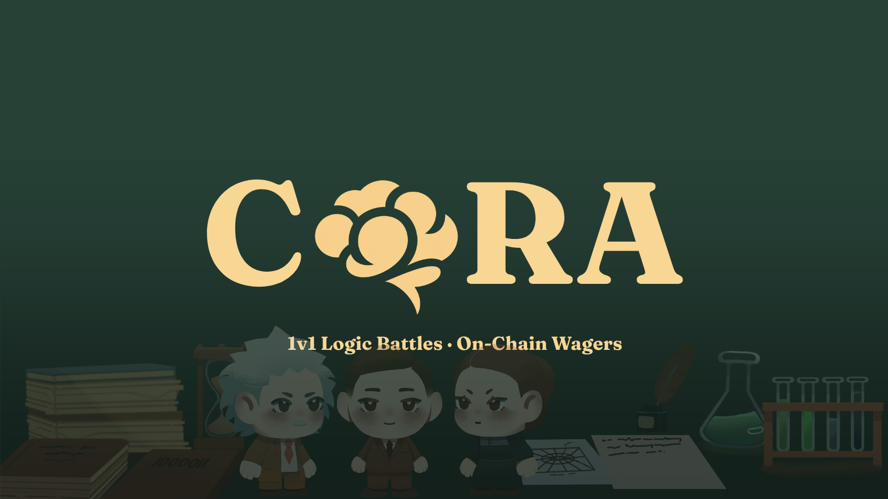

<div align="center">

<p><i>⚠️ CORA is still on Devnet. Fund your wallet with Devnet SOL from a faucet before trying the app.</i></p>



<h3 align="center">Wager your mind. Settle on-chain.</h3>

<p align="center">
  <a href="#tech-stack">
    
  </a>
  <a href="#tech-stack">
    
  </a>
  <a href="#tech-stack">
    
  </a>
  <a href="#architecture">
    
  </a>
  <a href="#tech-stack">
    
  </a>
  <a href="#tech-stack">
    
  </a>
</p>

</div>

## Signal

CORA is a web3 aptitude-battle project built on Base (Base Sepolia testnet).

Players connect an EVM wallet, lock a native-ETH wager, enter a real-time head-to-head battle, answer timed aptitude questions, and settle the result on-chain. Public queue play and private challenge links both feed into the same core battle loop. Gameplay is server-authoritative (the game engine); the on-chain `CoraEscrow` contract handles wager custody and settlement.

This repository is the active monorepo for the current CORA implementation.

## Why CORA

Most test-prep products are solitary, repetitive, and forgettable.

| Traditional Prep | CORA |
|---|---|
| solo drills | real-time PvP aptitude battles |
| low-consequence repetition | stake-backed focus and urgency |
| closed study sessions | Solana-native shareable challenges |
| local app-only logic | programmable, verifiable battle-state flows |

The result is a product that feels closer to a web3 arena than a traditional education app.

## Core Experience

### Public Queue

```text
wallet connect -> join queue -> FIFO match -> deposit escrow -> battle -> settle/refund
```

### Blink Challenge

```text
create challenge -> fund open challenge -> share Blink -> rival accepts -> battle -> settle/reclaim
```

### Battle Layer

```text
WebSocket room -> timed questions -> scientist abilities -> best-of-3 rounds -> result dispatch
```

## Architecture

| Layer | Role | Lives In |
|---|---|---|
| Money Layer | wager custody, open challenge funding, match activation, EIP-712 settlement verification, refund/reclaim flows | `packages/contracts/evm` (`CoraEscrow.sol`) |
| Battle Layer | real-time battle sessions, round effects, timeout resolution, terminal outcomes — server-authoritative | `apps/api` (game engine) |
| App Layer | landing, lobby, queue, challenge UX, WebSockets, match orchestration | `apps/web`, `apps/api` |

Gameplay is server-authoritative: the game engine computes all battle outcomes; the API server signs the EIP-712 settlement and submits it to the escrow contract on Base Sepolia.

## Tech Stack

| Surface | Stack |
|---|---|
| Frontend | Next.js 16, React 19, TypeScript, Tailwind CSS 4, Framer Motion, wagmi + viem + RainbowKit, TanStack Query |
| Backend | Bun, Hono, WebSockets, TypeScript, viem |
| On-Chain / Web3 | Base Sepolia, Solidity, Foundry, native-ETH escrow, EIP-712 settlement |
| Data / Services | Supabase |

## Repo Map

```text
Cora/
|-- apps/
|   |-- api/                  # backend, matchmaking, actions, room runtime
|   `-- web/                  # frontend app
|-- packages/
|   |-- contracts/evm/        # CoraEscrow.sol (Foundry) — Base Sepolia escrow
|   |-- game-logic/           # battle engine and anti-cheat heuristics
|   |-- shared-types/         # shared types, escrow constants + ABI (EIP-712)
|   `-- ui/                   # placeholder shared UI package
|-- data/
|   |-- fixtures/
|   |-- questions/
|   `-- tokens/
|-- docs/
|   `-- MASTER.md             # high-level project source of truth
`-- scripts/
```

## Local Development

```bash
npm install
```

| Step | Action |
|---|---|
| 1 | Install dependencies from the repo root with `npm install` |
| 2 | Configure `apps/api/.env` (Base Sepolia RPC, `SERVER_PRIVATE_KEY`, `ESCROW_CONTRACT_ADDRESS`, Supabase) and `apps/web/.env.local` (`NEXT_PUBLIC_BASE_SEPOLIA_RPC_URL`, `NEXT_PUBLIC_ESCROW_ADDRESS`, `NEXT_PUBLIC_WALLETCONNECT_ID`) — see `.env.example` |
| 3 | Start the backend with `cd apps/api` then `bun run dev` |
| 4 | Start the frontend in a second terminal with `cd apps/web` then `npm run dev` |
| 5 | Open `http://localhost:3000` for the web app and `http://localhost:8080` for the backend |

## Product Reference

For the full project map, architecture, and implementation reference, see [docs/MASTER.md](docs/MASTER.md).

## Closing

CORA is designed to feel like a web3 arena product first and a study product second:

| Instead Of | CORA Uses |
|---|---|
| accounts | wallets |
| links | challenges |
| points | escrow |
| local-only simulation | delegated battle state |

If you are here to feel the product, start the web app and enter the arena.
